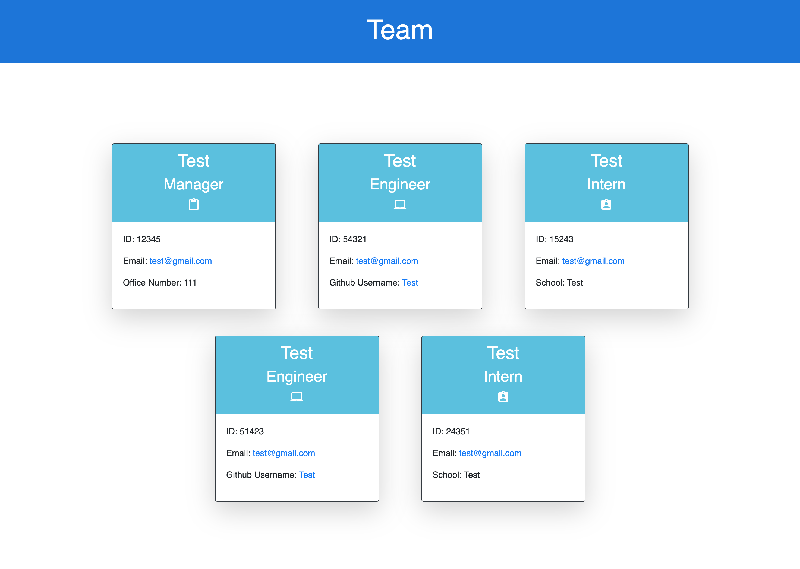
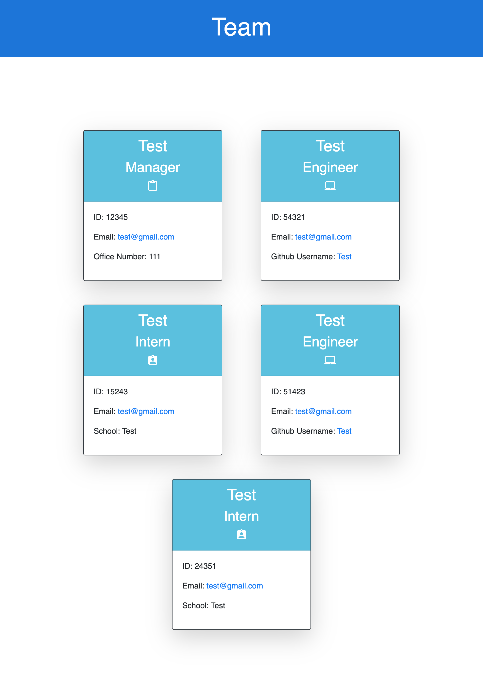

  # oop-team-generator

  

  ## Table-of-Contents

  * [Description](#description)
  * [Installation](#installation)
  * [Usage](#usage)
  * [Screenshots](#screenshots)
  * [Credits](#credits)
  * [Tests](#tests)
  * [Questions](#questions)
  
  ## [Description](#table-of-contents)

  This project is a webpage generator that creates individual employee cards. These cards display the employees name, role in the team, ID number, and email. Depending on what employee role that is chosen, there is other input fields to add to the card. Engineers get a github username, Managers get an office number, and Interns get there school displayed. This helps show who is in a team, what they specifically do, how to reach out to them, and details about them.

  I created this project for the Georgia Tech Coding Bootcamp. This is for a challenge demostrating my ability to use Object Oriented Programming and using Test Driven Development.

  A person can use this project to display a team of people on a webpage to better understand their roles and give contact information. This can also be used to learn OOP and TDD coding practices.

  ## [Installation](#table-of-contents)

  You can install this project by going to this individual repository from my github profile and cloning the code to your local device using a URL or SSH Key.

  ## [Usage](#table-of-contents)

  To operate this project, you need to have multiple things installed. You need NPM, NOde.js, Inquirer, and Jest imnstalled to your local devices terminal or coding platform such as Visual Studio Code. Once these are installed, you can go into the terminal based from the oop-team-generator code folder and enter "node index". This will dsiplay the prompts which you can follow and once completed, will create the HTML page you need to display the team.

  ## [Screenshots](#table-of-contents)

  Main Page

  

  Responsive Example

  
  
  ## [Credits](#table-of-contents)

  This is for a class assignment so no contribution is needed.

  ## [License](#table-of-contents)

  This application is under the following license:

  [mit](https://choosealicense.com/licenses/mit)
    
  ## [Tests](#table-of-contents)

  THe testing methods are built into the code itself. The folder "_tests_" is where this code is located. All you need to do is have "jest" and "npm" installed and you can enter "npm run test" in your coding platforms terminal. This will run test cases for all the code in the project and assess whether the application is functioning.

  ## [Questions](#table-of-contents)

  Contact Information:

  GitHub: (https://github.com/AaronDreyer)

  Email: aaronottaway@gmail.com
